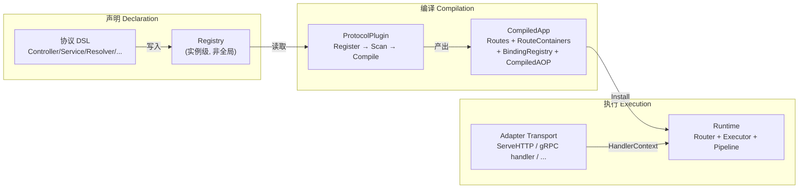
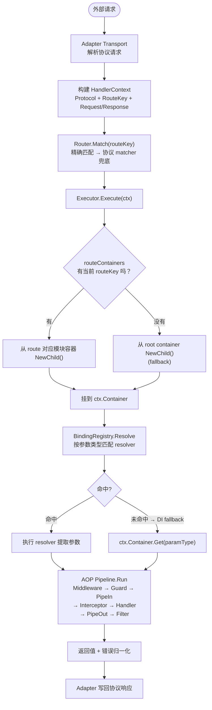
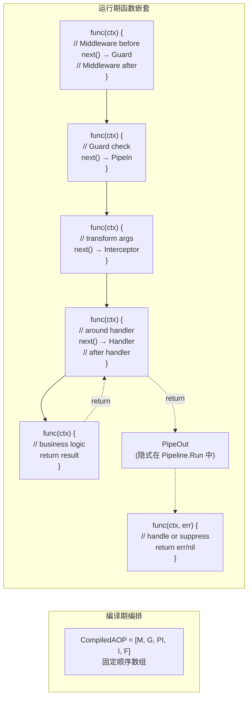
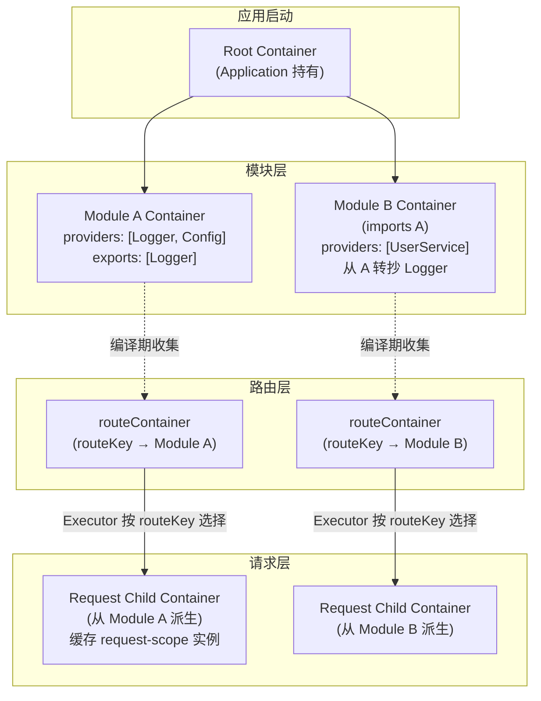
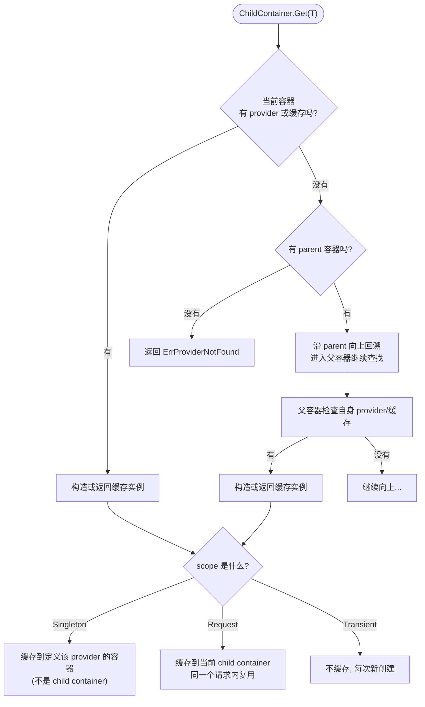
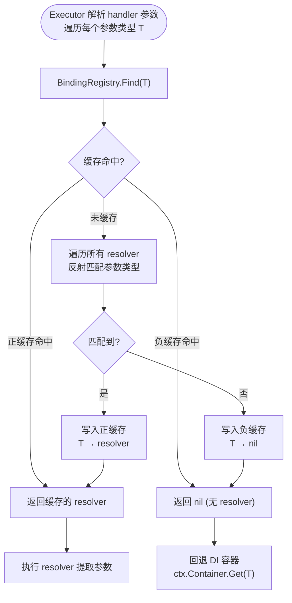
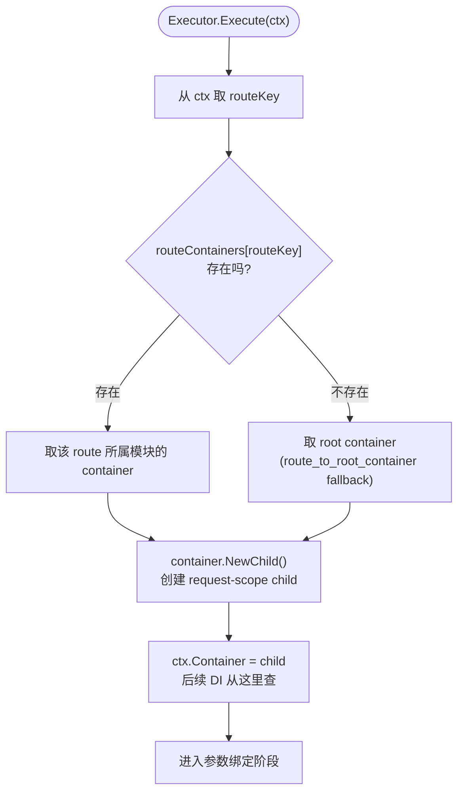
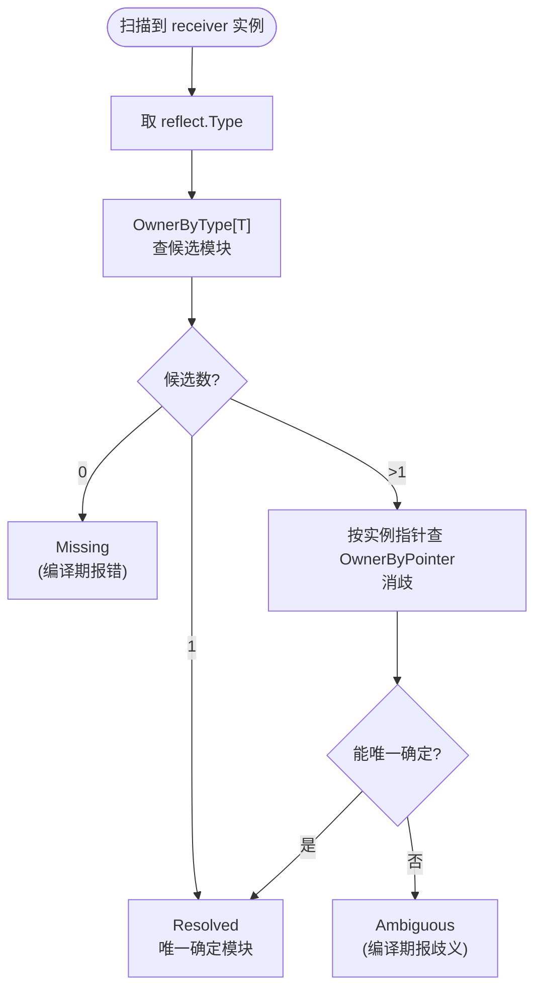

# lania-g 面试核心链路速查

## 0. 一句话定位项目

**在 Go 里做 NestJS 风格的声明式框架**，核心矛盾是：Go 没有装饰器/注解元编程能力，所以需要靠 **编译期扫描 + 结构化产物** 来弥补。

---

## 1. 三段式总览



**面试回答骨架**：

> "Go 没有装饰器，所以我把 NestJS '运行时反射注册' 拆成了三步：先用 DSL 往 Registry 写声明，再用 Compiler 统一扫描编译成结构化产物，最后 Runtime 只消费产物不推导。代价是编译期变重了，但换来了运行期可预测和反射成本降低。"

---

## 2. 编译期 Compile 完整流程

```mermaid
flowchart TB
    Start(["Application.Run() / CompileDiagnostics()"]) -->
    StableSort["1. 对 plugins 做稳定排序"] -->
    RegisterLoop["2. 遍历 plugins: Register(reg)<br/>补默认 binding / 声明"] -->
    FreezeBR["3. 冻结 BindingRegistry<br/>运行时不再重新推导"] -->
    Snapshot["4. 构建 snapshot<br/>(模块树只读视图)"] -->
    OwnerIndex["5. 构建 owner index<br/>OwnerByType + OwnerByPointer"] -->
    
    subgraph PluginLoop ["6. 遍历 plugins"]
        Scan["Scan(moduleRef, reg)<br/>扫描声明, 推导归属"]
        Compile["Compile(scan, reg, globalAOP)<br/>生成 routes + containers + AOP"]
        Scan --> Compile
    end

    FreezeBR --> PluginLoop
    OwnerIndex -.->|注入上下文| Scan
    
    Compile --> ConflictCheck["7. 跨协议 routeKey 冲突检测"]
    ConflictCheck --> Bundle["8. 打包为 CompiledApp"]
    Bundle --> Install["9. Install(runtime)<br/>→ 新 Router + matchers<br/>→ BindingRegistry → Executor<br/>→ RouteContainers → Executor<br/>→ 全局 AOP → Pipeline"]
```

**面试追问**：

| 问题 | 答案要点 |
|------|---------|
| 为什么不直接用全局 Registry？ | 多应用并存有状态污染，实例级 Registry 隔离，编译期能检测冲突 |
| `routeContainers` 有什么用？ | 让请求直接落到所属模块的容器，而不是退回 root container |
| `CompiledApp` 包含什么？ | BindingRegistry + Protocols(map) + RouteContainers + GlobalAOP + Diagnostics |
| Install 为什么创建新 Router？ | 避免边运行边拼接，安装后才切换，保证原子性 |

---

## 3. 请求期 Execute 完整流程



**面试回答骨架**：

> "请求进来后，Transport 先建一个协议无关的 HandlerContext，然后 Router 按 routeKey 匹配 handler。Executor 接手后先选容器——优先走 routeContainers 里预编译的模块容器，没有就回退到 root。然后做参数绑定：先问 BindingRegistry 有没有对应的 resolver，没有再 fallback 到 DI 容器。最后过 AOP Pipeline 执行 handler。"

---

## 4. AOP Pipeline 执行顺序

```mermaid
flowchart LR
    Start(["请求进入 Pipeline"]) -->
    M["Middleware<br/>请求预处理"]
    M -->|next()| G["Guard<br/>鉴权/限流"]
    G -->|通过| PI["Pipe (Input)<br/>参数变换/校验"]
    PI --> I["Interceptor<br/>包裹 handler 调用<br/>(tracing/metrics/重试)"]
    I --> H["Handler<br/>业务逻辑"]
    H --> PO["Pipe (Output)<br/>返回值变换"]
    PO --> F["ExceptionFilter<br/>异常归一化"]
    F --> End(["响应写出"])

    G -->|拒绝| F
    PI -->|失败| F
    I -->|panic/error| F
```

**关键细节**：

- 全局 AOP 在编译期合并进各 handler 的 `CompiledAOP`，运行时优先用编译产物
- 如果某个 handler 没有 `CompiledAOP`，才回退到 runtime 的全局 AOP fallback（`runtime_global_aop`）
- 任一环节 return 错误，后续非 filter 环节不再执行
- Filter 可以消费错误返回 nil（表示错误已处理），也可以继续返回 error

**面试追问**：

| 问题 | 答案要点 |
|------|---------|
| Pipeline 顺序怎么保证的？ | 编译期收敛成 `CompiledAOP` 数组，运行时按固定顺序遍历执行 |
| Interceptor 和 Middleware 的区别？ | Middleware 在路由匹配前，Interceptor 包裹 handler 调用，可以做 around advice |
| Filter 返回 nil 会怎样？ | Pipeline 认为错误已消费，不再继续传播 |

---

## 4.1 Pipeline 链式调用的实现模式（函数嵌套 vs Gin 中间件栈）

Pipeline 不是 Gin 那种 `c.Next()` 的平铺中间件栈，而是**编译期编排好的函数嵌套**：



**代码层面的示意**（非实际代码，仅展示嵌套逻辑）：

```go
// Pipeline.Run 的简化逻辑
func (p *Pipeline) Run(ctx *HandlerContext) (interface{}, error) {
    chain := func(ctx *HandlerContext) (interface{}, error) {
        return handler(ctx) // 最内层
    }
    // 从后往前包装：Filter → Interceptor → PipeIn → Guard → Middleware
    for i := len(aopChain) - 1; i >= 0; i-- {
        chain = aopChain[i].Wrap(chain)
    }
    return chain(ctx)
}
```

**和 Gin 中间件的区别**：

| 维度 | Gin 中间件 | 本框架 Pipeline |
|------|-----------|----------------|
| 组织方式 | 运行时平铺数组 | 编译期编排 + 运行期函数嵌套 |
| 控制流 | `c.Next()` 跳转 + `c.Abort()` 中断 | 显式 `next()` 调用 + 错误 return 短路 |
| 层级种类 | 只有中间件 | 7 种语义不同的阶段 |
| 编译期优化 | 无 | 全局/局部 AOP 在编译期合并成 `CompiledAOP` |

---

## 5. DI 容器树与 Scope



**三种 scope 行为**：

| Scope | 缓存位置 | 生命周期 |
|-------|---------|---------|
| `Singleton` | 定义该 provider 的模块容器 | 应用级 |
| `Request` | 当前请求的 child container | 单次请求 |
| `Transient` | 不缓存 | 每次新创建 |

**imports/exports 不是共享容器**，而是把实例**转抄**到当前模块容器——这样模块边界更清晰，但初始化时有复制成本。

**循环依赖检测**：容器内部维护 `resolving map[token]bool`，如果在构造链里再次遇到同一个 token 就报错。

---

## 5.1 Container.Get(T) 的 parent 回溯查找

面试高频追问：**"如果 Module B 的容器里没有 Logger，它能从 Module A 拿到吗？拿到后缓存落在哪里？"**



**关键语义**：

- `Singleton` 实例**不会**缓存到 child container——即使是通过 child container 触发的构造，实例也缓存到定义了该 provider 的父容器
- `Request` 实例缓存到当前 child container，同一次请求内共享；**不会**回写到父容器
- 查找沿 parent 链向上，但**缓存位置按 scope 规则决定**，不一定落在查找路径上

**面试话术**：

> "查找是向上回溯的，但缓存位置取决于 scope。Singleton 实例回写到定义它的模块容器——所以即使用户是通过 child container 触发构造的，最终实例还是落在模块层，下一个请求的 child container 也能从父容器拿到同一个实例。Request scope 则只缓存在当前 child container，请求结束就丢弃。"

---

## 6. BindingRegistry 正/负缓存



**为什么不是每次都全量反射扫描**：

- 热路径上 handler 参数类型是固定的，不需要重复匹配
- 正缓存：某类型命中了哪个 resolver
- 负缓存：某类型没有可用 resolver（避免每次都扫一遍确认没有）
- 缓存在 `CompiledApp` 安装时冻结，运行期不动态增减

---

## 7. routeContainers 选择逻辑（Executor.Execute）



**这条逻辑的意义**：

- 两个不同模块中同名的 `UserController` 会被分配到不同的容器
- 各自模块的 provider（DB、Config 等）不会互相串
- 没有 routeContainer 的 handler 虽然也能跑，但会丢失模块隔离性

---

## 8. 当前仍在用反射的地方（容易被问到）

| 位置 | 原因 | 为什么没去掉 |
|------|------|------------|
| HTTP struct 绑定 | `binding/http` 把请求体反射映射到结构体字段 | 没有泛型约束，必须反射 |
| GraphQL args 转换 | args 到 DTO 的字段赋值 | GraphQL 类型系统与 Go 类型系统需要桥接 |
| gRPC stream wrapper | 泛型包装器的类型检查 | Go 泛型能力有限，部分检查需要 reflect |
| DI 容器 `Get(T)` | 按 `reflect.Type` 做 key 查找 | 这是 DI 容器的核心机制 |
| `owner index` 构建 | `reflect.Type` 作为 map key | 没有稳定替代方案 |

**面试话术**：

> "我们没幻想消灭反射。编译期前置压缩的是**推导性反射**——比如'这个 handler 参数应该走哪个 resolver'、'这条 route 属于哪个模块'。但**执行性反射**——比如 HTTP 把 JSON body 映射到 struct、DI 按类型取值——这些是 Go 本身没有替代方案的，只能兜住。"

---

## 9. 六协议全景对比（从声明到执行的完整差异）

面试高频追问：**"六种协议具体差异在哪？不只是 owner 来源。"**

| 维度 | HTTP | gRPC | GraphQL | WS | MQ | Scheduler |
|------|------|------|---------|-----|-----|-----------|
| **声明粒度** | Controller + Route(method/path) | Service + Method + RPCMode | Resolver + Field(Query/Mutation) | Gateway(namespace) + On(event) | Consumer + On(topic) | Job(name) + Trigger |
| **路由匹配** | method/path matcher tree | service+method 精确匹配 | schema field 分发 | namespace+event 精确匹配 | topic 匹配 | triggerKind+jobName |
| **transport** | `ServeHTTP` 入口 | `grpc.Server` 动态注册 ServiceDesc | GraphQL transport, 按 field 多次进 runtime | socket 回调, 每次事件构造 HandlerContext | driver 轮询消息 | cron/ticker 时间触发 |
| **binding 重点** | body / query / param / header / form / cookie / file | proto message / metadata / ServerStream / ClientStream / BidiStream | args / parent / variables / selection-set / info | message / header / socket / room / event | message / header / topic / key / ack / nack | job metadata / run id / scheduled at |
| **返回值写回** | status + header + body + redirect/render | unary 直接 return; stream 通过 wrapper 发消息 | GraphQL `data/errors/extensions` | emit response/error event | ack / nack | retry / history / metrics |
| **Owner 来源** | controller | controller + resolver + provider | controller + resolver | controller + resolver | controller + resolver + provider | controller + resolver + provider |
| **特殊点** | 桥接最多: swagger/auth/otel/terminus | 四种 RPC 模式; 编译前签名校验 | schema 是编译期关键产物; 不是按 path 分发的 | 长连接 + 事件驱动; 连接生命周期长 | 无同步响应; 成功失败体现在 ack | 无网络请求; 时间驱动 |

**Owner 解析算法**：按类型缩小候选 → 按指针消歧



---

## 10. 当前项目短板（面试中主动坦诚反而加分）

| 短板 | 具体情况 | 推荐话术 |
|------|---------|---------|
| **缺少 benchmark 数据** | 编译期优化的效果没有量化指标，BindingRegistry 缓存命中率、反射减少比例等都没有测量 | "这是我们已知的短板。优化主要通过代码审查和链路分析来验证，量化性能测试是后续计划中的工作。如果这个项目要继续生产化，benchmark 和 profiling 是首先要补的。" |
| **owner 规则未完全统一** | 六协议的 owner 来源不一致（有的只认 controller，有的认 resolver/provider），增加了扫描规则的复杂度 | "设计上我们希望所有协议统一 owner 来源，但目前六协议的历史演进路径不同，还没有完全对齐。这属于可接受的框架复杂度——不影响正确性，但增加了认知成本。" |
| **binding 层仍大量依赖反射** | HTTP struct 绑定、GraphQL args 转换、gRPC stream wrapper 等热路径上仍有反射 | "我们没幻想消灭反射。编译期前置压缩的是推导性反射（参数走哪个 resolver、路由归属哪个模块），但执行性反射——比如 JSON binding 到 struct、DI 按类型取值——这些是 Go 没有替代方案的。" |
| **imports/exports 有复制成本** | 实例转抄而不是容器共享，模块层级多时初始化成本上升 | "这是为了模块边界清晰做的取舍。共享容器虽然更快，但会让模块间的依赖关系变成隐式的。当前方案在初始化时多花一点 CPU，换来的是运行时依赖关系可预测。" |
| **缺少生产级治理能力** | 没有内置限流、熔断面板、admin UI 等 | "当前框架的定位是应用骨架，不是完整平台。resilience integration 提供了策略定义能力，但治理面板和可视化运维不在当前范围内。如果需要，可以在 integrations 层补充。" |

---

## 11. 关键词对照表（面试时用项目术语）（面试时用项目术语）

| 简历用语 | 项目实际术语 |
|---------|------------|
| "反射前置到编译期" | Compiler 产出 `CompiledAOP` + `routeContainers` + `BindingRegistry`，Runtime 只消费 |
| "AOP" | Pipeline: Middleware → Guard → Pipe → Interceptor → Filter |
| "DI 容器" | 模块树容器 + request child container + `imports/exports` 转抄 |
| "多协议统一" | 六协议共享 Runtime + Router + BindingRegistry + Pipeline |
| "模块化" | `Module.CreateModule(imports, providers, controllers, resolvers, exports)` |
| "路由预编译" | HTTP 路由在 Compiler 阶段构建 method/path matcher tree |
| "正负缓存" | `BindingRegistry.Find()` 缓存 resolver 匹配结果 |
| "编译诊断" | `CompileDiagnostics()` + `StartupReport()` + fallback inventory |
